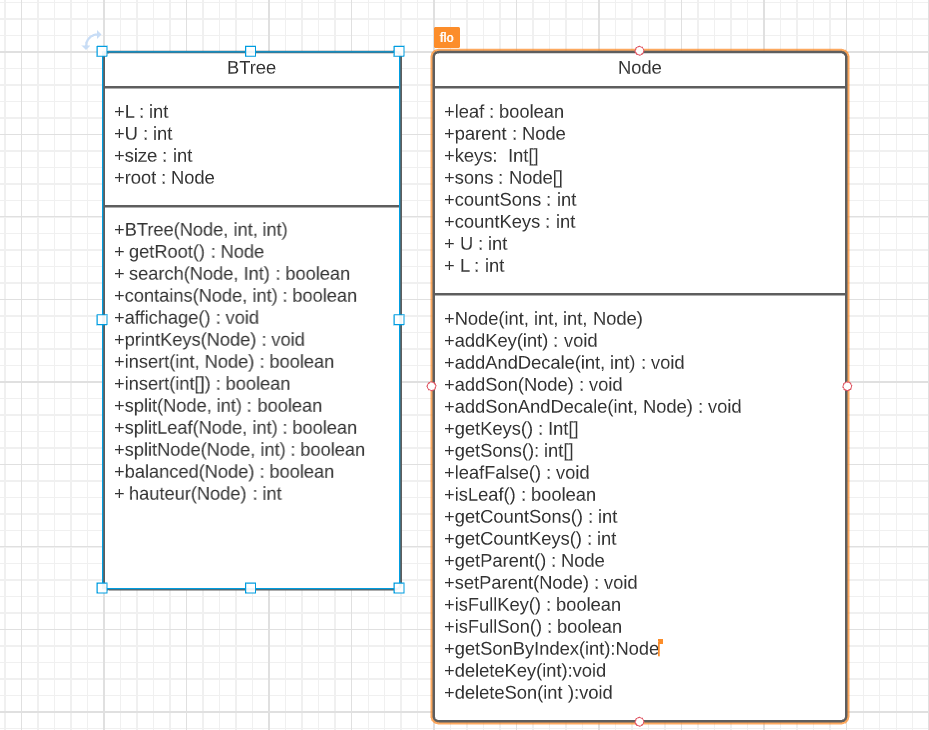
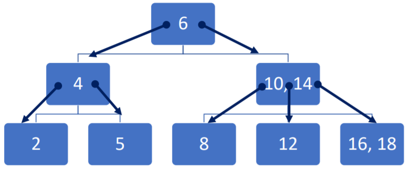

# Arbre B

Ce dépôt contient les fichiers du projet sur les arbres B réalisé pendant lors d'un UE à l'Université de Lille.

# Auteurs

- Havart Florentin
- Bugnon Florentin
  
# UML

# Rapport

- v1 : 02/02/2022

Nous avons décidé de coder ce projet en Java.
Jusqu'à aujourd'hui nous avons travaillé sur l'algorithme de recherche. Concernant la structure de données, nous avons une classe représentant l'arbre B, ainsi qu'une classe représentant un noeud contenu dans l'arbre B.
Nous avons rencontrés un problème lors de la définition de l'ensemble des fils d'un noeud. En premier lieu nous avions choisi une ArrayList qui permettait une allocation dynamique et l'utilisation de toutes les méthodes qui y sont liées, mais cela nous posait des problèmes d'indexation lors du parcours de la liste dans une boucle. Nous avons alors décidé d'utiliser un tableau simple de Java, de taille fixée au début. Ainsi, les cases ne contenant aucune valeur aurait simplement la valeur "null".

## contenu de Node :
Cette classe représente un noeud d'un arbre N-Aire. On l'a défini avec une valeur, un nombre pour le nombre de valeur minimum, et un nombre pour le nombre de valeur maximum qui sera contenu dans chaque noeud de l'arbre.
On a un tableau de clés et de fils, ainsi que deux attributs représentant le nombre de clés et de fils contenus dans le noeud. On initialise le tableau de clés avec la valeur 0 (à changer)
On initialise le tableau de sons avec des valeurs null.
Il y a aussi un attribut boolean qui est True si le node est une feuille. Il y a un attribut node parent qui représente le parent du noeud. Ce parent est null si le noeud est la racine de l'arbre.

## Contenu de Btree :

Cette classe représente un arbre N-Aire. On l'a défini avec un noeud racine, un nombre pour le nombre de valeur minimum, et un nombre pour le nombre de valeur maximum qui sera contenu dans chaque noeud de l'arbre.
On a, en plus comme attribut, la taille de l'arbre.  

## Algorithme Search :

- On regarde si c'est le noeud est une feuille
  -> Si oui, on regarde la valeur qu'on recherche est dans les clés du noeud

- Sinon
  -> on regarde la valeur qu'on recherche est dans les clés du noeud
  -> Si elle n'y est pas, on cherche le fils qui peut contenir la valeur qu'on cherche, et on applique l'algo de manière récursive sur ce noeud.
	on increment une variable de 0 à n tant que:
			 n est plus petit que le nombre de clé maximum dans un noeud
			 et que la valeur qu on cherche est plus petite que la valeur à l index i dans le tableau de clé du noeud
			 et que l'index de i dans le tableau des clés soit différent de 0 (comme on initialise à 0) 
				  -> on appelle search avec le fils correspond (celui qui corresppond à l index i dans le tableau des fils)

	

exemple de la recherche avec le nombre 6:
	le noeud n'est pas une feuille donc on rendre dans le sinon
	la valeur est dans le noeud donc on retourne true

exemple de la recherche avec le nombre 10:
	le noeud n'est pas une feuille donc on rendre dans le sinon
	la valeur n est pas dans le neoud donc on iter sur i 
  		i=0 , i < 3 ,  10 > 6 , 6 != 0 -> i=1
		i =1 , i<3 , 10 > 0 , 0 n est pas différent de 0 , donc on arrete le tant que
		on recommence  la recherche sur le noeud 10,14
			le noeud n'est pas une feuille donc on rendre dans le sinon
			la valeur est dans le noeud donc on retourne true	
		
exemple de la recherche avec le nombre 12:
	le noeud n'est pas une feuille donc on rendre dans le sinon
	la valeur n est pas dans le neoud donc on iter sur i 
  		i=0 , i < 3 ,  12 > 6 , 6 != 0 -> i=1
		i =1 , i<3 , 12 > 0 , 0 n est pas différent de 0 , donc on arrete le tant que
		on recommence  la recherche sur le noeud 10,14
			le noeud n'est pas une feuille donc on rendre dans le sinon
			la valeur n est pas dans le neoud donc on iter sur i 
			i=0 , i< 3 , 12 > 10 ,  10 != 0  -> i=1
			i=1 , i<3 , 12 < 14 -> donc on arrete i=1
				on fait la recherche sur le noeud index 0 dans le tableau de fils 
				le noeud est une feuille , et il contient 12 donc on retourne true

(si la valeur n'est pas dans l'arbre , on retrouvera le même résulat sauf qu'on trouvera pas la valeur dans le noeud et on retournera false)

